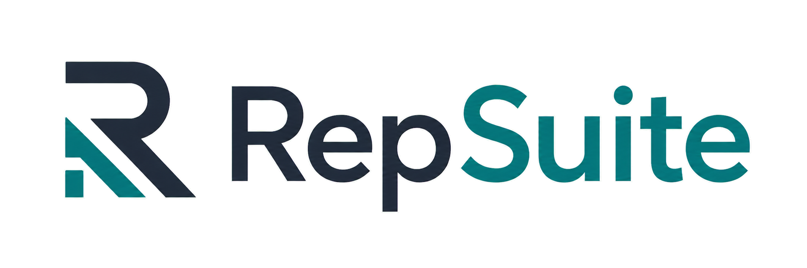

<p align="center">
  
</p>

# RepSuite

RepSuite is a static launcher for RepStack, RepReport, RepOS, and RepGuard. Each app has its own repository and deployment.

[Open RepSuite](https://repsuite.vercel.app)

## Projects

### RepStack

A review collection and tracking app built to manage review cards, pay periods,
bonus estimates, promises, and export readiness.

### RepReport

A review parsing and export tool that turns collected review information into a
clean report-ready format.

### RepOS

A prototype for managing support tickets, queues, and assignments.

### RepGuard

An evidence and claim review tool for organizing claim details, uploaded
evidence, and risk signals for manual review.

## Current MVP Scope

The launcher uses Next.js and TypeScript and is hosted on Vercel. It has no authentication, database, backend services, or third-party integrations.

Some downstream app links may still be placeholders while the individual tools
continue to mature.

## Local Development

Install dependencies:

```bash
npm install
```

Run the development server:

```bash
npm run dev
```

Run type checks:

```bash
npm run typecheck
```

Build for production:

```bash
npm run build
```

The app runs locally at [http://localhost:3000](http://localhost:3000) by
default.
